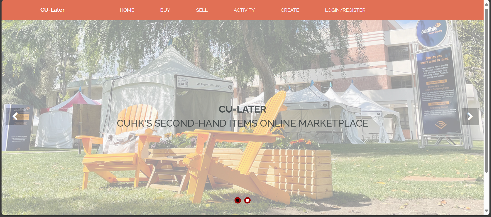

# CU-Later: A Comprehensive Second-Hand Marketplace & Community Platform for CUHK

CU-Later is a dedicated platform for the CUHK community, addressing the need for a local marketplace for second-hand items and a community page for promoting CUHK activities. CU-Later aims to streamline the exchange of valuable items and information within the campus community.

The platform is particularly beneficial for students and staff frequently moving in and out of on-campus hostels, and departments seeking to exchange items. It addresses the limitations of existing systems by providing an organized, user-friendly platform with detailed item information and immediate access.

CU-Later not only supports environmental sustainability by promoting reuse and reducing waste, but also fosters community engagement. By facilitating a circular economy and a vibrant community page, CU-Later contributes to a more sustainable and interconnected campus community.

Visit our website at [CU-Later](https://cu-later.onrender.com/).

## Installation

### Running CU-Later Locally

Ensure you have Node.js, npm, and Docker installed on your machine.

Follow these steps to run CU-Later:

1. Clone the repository: `git clone https://github.com/hanjihun2000/cu-later`.
2. Navigate to the project directory: `cd cu-later`.
3. Install dependencies: `npm install`.
4. Run the application: `docker-compose up --build -d` (Ensure Docker is running).

This will start CU-Later on your local machine.

### Use Website hosted on Render

You can access the live version of CU-Later hosted on Render. This allows you to use the platform without needing to install or run anything on your local machine.

To use CU-Later on Render, simply visit the following URL: [CU-Later](https://cu-later.onrender.com/).

## Contributing

We welcome contributions from the community! If you would like to contribute to CU-Later, please follow these steps:

1. Fork the repository.
2. Create a new branch for your feature or bug fix.
3. Make your changes and commit them.
4. Push your changes to your forked repository.
5. Submit a pull request to the main repository.

Please ensure that your code follows our coding conventions and includes appropriate tests.

## License

CU-Later is licensed under the [MIT License](LICENSE).

## Contact

If you have any questions, suggestions, or issues, please feel free to [open an issue](https://github.com/hanjihun2000/cu-later/issues) on GitHub.

We appreciate your feedback and contributions!
